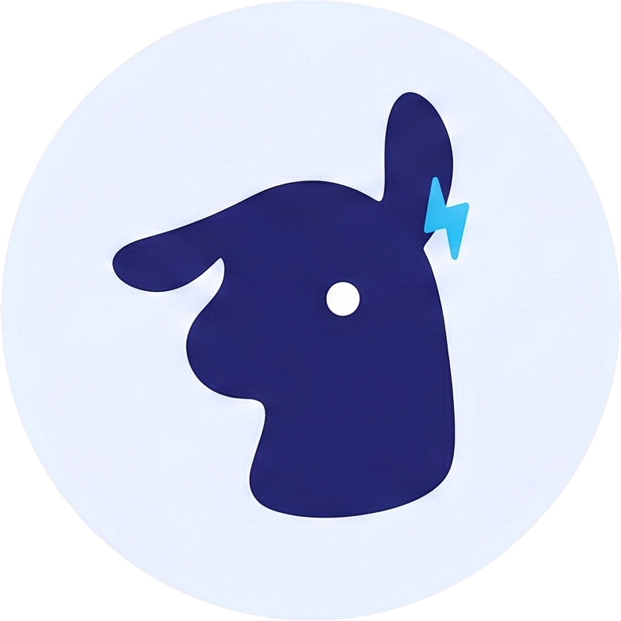

# Shep – Ollama Model Manager

[](https://opensource.org/licenses/MIT)
[](https://www.apple.com/macos/)
[](https://react.dev)
[](https://fastapi.tiangolo.com)

A sleek, modern GUI for managing your local Ollama models on macOS. Built with React, FastAPI, and designed for speed.



## Table of Contents

- [About Shep](#about-shep)
- [Features](#features)
- [Prerequisites](#prerequisites)
- [Quick Start](#quick-start)
- [Usage](#usage)
- [Troubleshooting](#troubleshooting)
- [Development](#development)
- [Contributing](#contributing)
- [License](#license)

## About Shep

Shep is a **mini shepherd mascot** guiding you through your Ollama models with a polished, modern interface. No terminal commands needed—just a friendly GUI that makes model management effortless.

- **For macOS users** who want a better way to manage Ollama
- **Fast and responsive** with real-time updates and streaming downloads
- **Production-ready** with daemon control, settings management, and comprehensive error handling
- **Easy to launch** with a single script that handles all setup

### User Interface

Clean, modern interface built with React and Tailwind CSS. Real-time model status, drag-and-drop simplicity, and a dashboard that actually makes sense.

## Features

Model Management
- View all locally installed Ollama models
- See model size and VRAM requirements
- Stop models to free up RAM (great when running multiple models)
- Delete models you no longer need

Daemon Control
- Check Ollama daemon status at a glance
- Start/stop the daemon directly from the UI
- Clear distinction between daemon and model status

Model Discovery
- Search for available models from the Ollama library
- Add new models with a single click
- Only shows models you don't already have

Modern UI
- Clean, polished interface (not another Streamlit app)
- Built with React + Tailwind CSS
- FastAPI backend for snappy performance
- Real-time updates every 5 seconds

## Prerequisites

1. **Ollama** must be installed on your Mac
   - Download from [ollama.ai](https://ollama.ai)
   - Or: `brew install ollama`

2. **Python 3.8+** - should already be on your system

3. **Node.js** - required for the React frontend
   - Download from [nodejs.org](https://nodejs.org)
   - Or: `brew install node`

## Quick Start

The easiest way to get started is using the **launch script**, which handles everything:

```bash
cd shep
chmod +x launch.sh
./launch.sh
```

Then open **http://localhost:5173** in your browser.

### What the launch script does

- **Checks prerequisites:** Ollama, Node.js, Python environment.
- **Installs dependencies:** npm and Python packages.
- **Starts services:** Backend (FastAPI) and frontend (Vite dev server).
- **Provides clear feedback:** Shows each step as it happens.

### Screenshots


### Manual Setup (Alternative)

If you prefer to start services separately:

```bash
# Terminal 1 - Backend
cd shep
source .venv/bin/activate  # or your preferred venv
python backend.py

# Terminal 2 - Frontend (in the same directory)
npm run dev
```

### Making the launch script executable

If you get "permission denied" when running `./launch.sh`:

```bash
chmod +x launch.sh
```

This makes the file executable. You only need to do this once.

## What's happening?

When you run `./launch.sh`, here's what's going on under the hood:

### Prerequisites Check
```
▶ Checking for Ollama...
✓ Ollama found (version 0.1.92)
▶ Checking for Node.js...
✓ Node.js found (v20.10.0)
▶ Checking for Python environment...
✓ Found Python venv at .venv-1
```

### Dependency Installation
```
▶ Checking for npm dependencies...
✓ npm dependencies found
▶ Checking Python dependencies...
✓ Python dependencies found
```

### Service Startup
```
▶ Starting FastAPI backend on http://localhost:8000...
✓ Backend is running (PID: 12345)
▶ Starting Vite dev server on http://localhost:5173...
✓ Ollama Manager is Ready!
```

### Architecture

- **Backend**: FastAPI server running on `localhost:8000`
  - Communicates with Ollama daemon (port 11434)
  - Manages model operations and settings
  - Updates `~/.zshrc` for configuration

- **Frontend**: Vite + React dev server on `localhost:5173`
  - Modern, responsive UI with real-time updates
  - Hot module reloading during development
  - Displays models, daemon status, download progress

## How to Use

### View Models
All your installed models appear in the table with:
- Model name and tag
- Total size on disk
- VRAM requirement (with info hover)
- Last modified date

### Stop a Model
Click the **pause/up arrow button** to unload a model and free its RAM.
Useful when you have multiple models running but only need one.

### Delete a Model
Click the **trash icon** to permanently delete a model from disk.
You'll be asked to confirm before deletion.

### Add a New Model
1. Click **+ Add Model**
2. Search for a model (e.g., "mistral", "llama", "neural-chat")
3. Click **Pull** to download and install it
4. The model will appear in your list once pulling is complete

### Daemon Status
The green/amber status card at the top shows:
- Whether the daemon is running (required for everything else)
- Start or stop buttons to control the daemon
- Info hover explaining the difference between daemon and models

## Troubleshooting

### Launch script errors

#### `bash: ./launch.sh: Permission denied`
Make the script executable:
```bash
chmod +x launch.sh
```

#### `✗ Ollama is not installed or not in PATH`
Install Ollama:
```bash
brew install ollama
# or download from https://ollama.ai
```

#### `✗ Node.js is not installed or not in PATH`
Install Node.js:
```bash
brew install node
# or download from https://nodejs.org
```

#### `✗ Python is not installed`
Install Python 3.8+:
```bash
brew install python3
# or download from https://www.python.org
```

#### `✗ Backend failed to start within 15 seconds`
This usually means:
1. Port 8000 is already in use:
   ```bash
   lsof -i :8000  # See what's using port 8000
   ```
2. Dependencies aren't installed:
   ```bash
   python -m pip install fastapi uvicorn requests
   ```
3. Run backend manually to see the error:
   ```bash
   python backend.py
   ```

#### `✗ Frontend process died unexpectedly`
Usually means npm dependencies are missing:
```bash
npm install
```

### Runtime issues

#### Daemon is not running
Make sure Ollama is running:
```bash
ollama serve
```
Or use the "Start Daemon" button in the Settings panel.

#### Models not showing up
1. Check that Ollama daemon is running (see above)
2. Make sure you've pulled models with `ollama pull <model-name>`
3. Try refreshing the page or clicking the refresh button in the UI

#### Can't connect to backend
1. Check if port 8000 is in use: `lsof -i :8000`
2. Look for error output in the launch script
3. Try starting the backend manually: `python backend.py`

#### Settings won't save
Make sure you have write permissions for `~/.zshrc`:
```bash
ls -la ~/.zshrc  # Check permissions
chmod 644 ~/.zshrc  # Fix if needed


## Development

Want to modify the UI or backend?

### Backend changes
Edit `backend.py` - FastAPI will auto-reload

### Frontend changes
Edit files in `src/` - Vite will hot-reload in the browser

### Install new packages
```bash
# Backend (Python)
source .venv/bin/activate
pip install <package-name>

# Frontend (Node)
npm install <package-name>
```

## Build for Production

```bash
npm run build
```

This creates an optimized build in `dist/`. You'd need to configure FastAPI to serve it.

## Environment Variables

Store custom Ollama model directory:
```bash
export OLLAMA_MODELS=/path/to/your/models
./launch.sh
```

## Tips & Tricks

- **Multiple models running?** Use the pause button to free RAM from models you're not using
- **Low on disk space?** Delete unused models with the trash icon
- **Want to keep the daemon running?** Start it separately in another terminal: `ollama serve`
- **Custom model path?** Set `OLLAMA_MODELS` before starting the daemon

---

Built for macOS users who love Ollama

## Contributing

Found a bug? Have a feature request? Contributions are welcome!

1. Fork the repository
2. Create a feature branch (`git checkout -b feature/amazing-feature`)
3. Commit your changes (`git commit -m 'Add amazing feature'`)
4. Push to the branch (`git push origin feature/amazing-feature`)
5. Open a Pull Request

## License

This project is licensed under the MIT License - see the [LICENSE](LICENSE) file for details.

---
